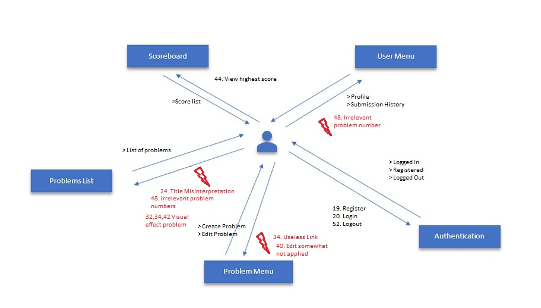
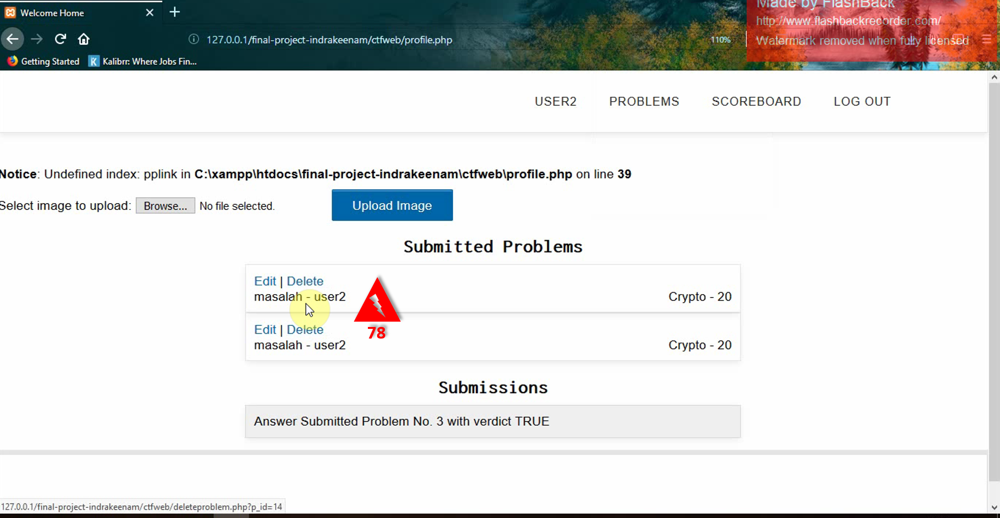

# Anggota kelompok

1. Firman Maulana - 05111640000059
2. Vinsensius Indra Suryanto - 05111640000064
3. Rahma Sofyantoro - 05111640000117

---

# Project Topic : CTFWeb

This web was a product form Indra's past assignment in Web Programming Course.

## System Description
Capture the Flag (CTF) is a special kind of information security competitions. There are three common types of CTFs: Jeopardy, Attack-Defence and mixed. This site focused on Jeopardy-style CTFs.

The Jeopardy-style CTF is similar to the actual Jeopardy game as the scoreboard looks like a Jeopardy board with different categories and point values. Some of the categories can include Cryptography, Steganography, Physical Security and Scanning. There are several other categories that can be used. Some of the challenges can be done against a main server that was developed for the CTF and the flag is inputted into the CTF scoreboard to get points for the team. A timer is used to start and stop the CTF and once the timer finishes, the game is over. The team with the most points at the end wins.

This site focuses on individual solving Jeopardies, and sharing their own problem to the others. Each user can post their own problems publicly, and they have access to all problem posted.


# Contextual Inquiry

## Question Script
This is the question that is asked before performing evaluation so we can understand what is the user's current background.

1. Did you categorize your self as an active internet user?
2. What kinds of website that you use daily?
3. Have you visited some website that you think has a bad design in it?
4. What did you think about it?
5. How difficult it is to achieve your desired goal using it?
6. What did you know about Capture The Flag?
7. Have you used a website that support Capture The Flag?
8. Have you use it before?
9. When the last time you use it?

## Evaluation Script
This script is used to evaluate the system's current interface. The user will be guided to follow this script.

1. Go to your dashboard
2. Show me the list of all available problems
3. Create a new problem and attach a file in it
4. Download a file from promblem X
5. Edit your last created problem
6. Solve problem X
7. Tell me the username with the highest score
8. Show me your submission history
9. Show me all of your submitted problems
10. Log out from the system

## Description

### Participant 1
- Male
- Informatics Student Batch 2017 at ITS
- Former Robotics Student
- Active Internet User
- Never do CTF before
- Didn't understand CTF

### Participant 2
- Male
- Informatics Student Batch 2017 at ITS
- Active in Competitive Programming
- Active Internet User
- Never do CTF before
- Know about by Definition

### Participant 3
- Male
- Informatics Student Batch 2017 at ITS
- Active in Capture The Flag
- Active Internet User
- Did some CTF in the past few days (Since the interview is held)
- Understand CTF

### Participant 4
- Male
- Informatics Student Batch 2016 at ITS
- Active Internet User
- Never do CTF before
- Know about CTF (Has seen it)

## Transcript

### Participant 1
```
Role :
Interviewer : Firman
Host : Indra
Recorder : Rahma

Interviewer = I
Interviewee = X
1. I : Disini kita akan melakukan percobaan terhadap suatu sistem yang kita buat, jadi kita tidak mengetes Anda, 
	jadi santai saja, tidak ada yang salah. Kalau ada yang salah berarti sistemya yang salah. Nanti akan ada
	sekumpulan instruksi untuk dilakukan.
2. I : Jadi disini kita akan melakukan ujicoba terhadap sistem web CTF. Sebelum dimulai saya ingin bertanya, apakah
	anda mengkategorikan Anda sebagai pengguna internet yang aktif? Jika ya, seberapa sering?
3. X : Sering, hampir setiap hari.
4. I : Website seperti apa yang Anda kunjungi biasanya.
5. X : Website seperti Youtube, gmail, dan masih banyak lagi.
6. I : Menurutmu, pernah tidak menemukan suatu web dengan desain yang jelek, sampai anda bingung.
7. X : Jarang, mungkin dulu pernah, tapi sudah lupa juga.	
8. I : Mungkin bisa dijelaskan lebih detail menurut anda, desain yang jelek seperti apa.
9. X : Mungkin jeleknya membuat kita tidak tahu harus ngapain, seperti munculin form yang tidak jelas,
      tombol-tombol yang tidak jelas, dll.
10. I : Ketika Anda menggunakan website yang memiliki desain yang jelek, mudah nggak untuk mencapai suatu tujuan?
11. X : Cukup mempersusah, meskipun ada desain yang bagus juga belum tentu menjamin kita mempermudah untuk
      melakukan tujuan kita.
12. I : Untuk lebih spesifiknya, apa yang Anda ketahui mengenai CTF?
13. X : Kurang tau CTF itu ngapain, masih nol.
14. I : Boleh tau background Anda?
15. X : Informatika, angkatan 2017
16. I : Karena belum tahu tentang CTF, benar apa tidak bahwa Anda juga belum pernah memakai web untuk CTF?
17. X : Ya, belum.
18. I : Masuk ke instruksi. Instruksi pertama, silakan menuju ke dashboard anda.
19. X : (04:50 mengecek domain memastikan sudah benar) Yaapa masuknya.
(04:58 menemukan register)
(05:23 selesai register, ke login)
(05:28 masuk ke dashboard)
20. X : Sudah
21. I : Jadi menurut anda, ini dasboard ya?
22. X : Ya.
23. I : Yang kedua, bisa sebutkan problem yang ada saat ini?
24. X : (Menyebutkan judul problemnya, serta nama pembuatnya)
25. I : Silakan buat problem baru.
26. X : (06:39 selesai membuat problem baru)
27. I : Bisa ditunjukkan problem yang baru saja anda buat?
28. X : (menunjukkan problem yang telah dibuat)
29. I : Coba cari sebuah problem , selain yang anda buat, kemudian download file tersebut.
30. X : Ok.
31. I : Disini tau nggak, problem yang memiliki file dimana?
32. X : Nggak tau.. (Beberapa saat) apa ini, disuruh apa tadi?
33. I : (Mengulangi instruksi)
34. X : (Mencari dan membuka problem satu per satu, mencoba browse problem namun tidak terjadi apa-apa)
(07:31 menemukan problem berisi file)
35. I : Bisa tunjukkan problem yang tadi Anda buat?
36. X : (Menunjukkan problem)
37. I : Tolong edit problem yang tadi dibuat
38. X : (Mencoba browse problem, tidak terjadi apa-apa, mencari problem satu-satu)
(08:11 menemukan edit problem)
(08:45 selesai edit problem)
39. I : Bisa ditunjukkan perubahannya?
40. X : (Menunjukkan problem yang telah diedit, sadar bahwa problem tidak berubah, mencoba edit lagi)
(09:30 Sukses edit problem)
41 I : Dari sekian banyak problem, selesaikan 1 buah problem yang menurut anda mudah, selain problem anda.
42. X : (09:52 Selesaikan 1 problem - sempat kebingungan apa yang terjadi karena background soal berubah menjadi abu-abu)
43. I : Silakan cek siapa yang memiliki skor tertinggi.
44. X : (10:12 Membuka Scoreboard, menyebutkan peraih skor tertinggi)
45. I : Lalu, tunjukkan Anda telah menyelesaikan problem apa saja.
46. X : (10:27 Membuka submission history), Ini submission, problem nomer 3.
47. I : Bisa nunjukkin problem nomor 3 yang mana?
48. X : (Membuka List of problems), Tidak.
49. I : Ok, jadi tadi kan sudah membuat sebuah problem, problem yang dibuat tadi yang mana?
50. X : Ini.
51. I : Sekarang sudah selesai, silakan keluar dari sistem ini.
52. X : Ok.
(11:22 berhasil log-out)
```
### Participant 2
```
Role :
Interviewer : Firman
Host : Indra
Recorder : Rahma

x : interviewr
y : interviewee

1. x : Disini kita menguji sistemnya,bukan menguji anda jadi dikerjakan sebisa mungkin,jadi kalau ada kesalahan yang salah itu sistemnya
2. y : oke
3. x : pertama itu kami harus mengerti dulu background anda itu seperti apa,jadi akan ada pertanyaan,
menurut anda ,anda itu pengguna aktif internet apa enggak ?
4. y :iya
5. x : seberapa aktif ?
6. y : seberapa aktifnya ya,bisa dikatakan ya setiap hari menggunakan internet
7. x : pernah mengunjungi website apa?
8. y : website yang paling sering apa ya,kalau dibilang 
lebih ke email sih,dari google ,gmail gitu sih
9. x : pernah gak menemui website yang memili desain yang buruk ?
10. y : pernah
11. x : pernah gak anda merasa kesulitan untuk mencapai yang anda tuju itu,misal kayak mau mendownload ?
12. y : adasih website yang mau mendownlod sesuatu entah dari iklannya,kira-kira harus menekan yang mana gitu 
13. x : menurut anda menggangu gak sih ?
14. y : cukup menggangu sih,kalau aku lebih suka website yang penting jelas,jadi misalkan mau login dimana,mau logout dimana,mau mencari dimana,jelas gitu 
15. x : pernah gak dengar kayak CTF gitu
16. y : pernah
17. x : Capture The Flag,Bisa gak jelasi CTF itu gimana ?
18. y : gabisa
19. x : secara sepengatahuan anda mungkin
20. y : kalau berdasarkan dari itu sendiri,capture the flag ngambil sesuatu, kita nyari sesuatu ,dapet gitu nyari dari manapun,nanti kalau yang kita cari dapet yaudah gitu
21. x : pernah gak menggunakan website yang mengadakan CTF gitu,pernah menggunakan aja,mungkin iseng-iseng
22. y : kurang tahu ya
23. x : jadi saya asumsikan belum
24. y : bisa diamsusikan begitu
25. x : nah sekarang kita mulai kebagai instruksi ya,saya akan menyebutkan beberapa instruksi ,anda cukup melakukan saja
26. y : oke
27. x : yang pertama itu silakan coba tunjukan dashboard anda dari website ini yang sudah dibuka
28. y :seharusnya ya ini udah (menunjukan login page)
29. x : oh iya,maksudnya kayak dashboard halaman,kalau ini (login page) kayak homepage,dashboardnya dimana?
30. y :apa harus register dulu ya ini
31. x : mungkin
32. y :(melakukan register)
33. x : Kalau anda menemukan kejanggalan bisa ngomong
34. y :(Partisipan melakukan login)
35. x : jadi ini dashboardnya (menunjuk dashboard),bisa gak nunjukin list problem yang ada ?
36. y :ini judulnya (menunjuk judul)
37. x : menurut anda bagaimana
38. y :kalau menurutku math1 indra,math0 vinsen,jadi ini judulnya(menunjuk judul),terus siapa yang membuat(menunjuk pembuat yang berada disamping judul),terus dikananya ada math-1,misc-5,math-10(menunjuk kategori dan score),mungkin type sama difficulty
39. x : jadi 1,20 itu difficulty
40. y : iya
41. x : oke,buat problem baru disitu bebas menambahkan file atau tidak
42. y : oke,(participant masuk ke halaman create problem,dan memasukan data di form create problem lalu mensubmit form)
43. x : bisa tunjukan yang tadi dibuat ?
44. y : ini (menunjukan problem yang telah partisipan buat tadi)
45. x : sekarang buat sebuah problem baru dan masukan file disitu
46. y : (masuk halaman create problem dan mengisi form create problem lalu mensubmit form)
47. x : sekarang tunjukan yang tadi anda buat
48. y : (menunjukan problem yang baru saja dibuat)
49. x : silahkan cari sebuah problem yang memiliki file selain problem anda dan problem partisipan sebelumnya
50. y : (partispan mengklik menu problem,dan mencoba mengklik browse problem) browse problemnya belum bisa
(partisipan mencoba mencari manual)ini (menunjukan problem)
51. x : bisa di download
52. y : bisa
53. x : silahkan edit problem anda yang tadi anda buat
54. y : (partisipan mengklik halaman profil lalu mengklik edit problem  dan memperbarui problem  )
55. x : sudah yakin teredit,apakah bisa ditunjukan hasilnya
56. y : kayaknya belum (partisipan belum terlalu yakin problem yang sudah di edit tersimpan) bentar aku cek lagi (partispan berpindah ke halaman lain terus kembali ke halaman edit untuk memastikan problem telah diperbarui) udah tapi pas tadi aku submit (menunjukan kendala) dia yang dilihat di deskripsinya  yang sebelumnya,sebelum diedit tapi pas dicek udah ada udah diubah berubah
57. x : tolong delete satu problem anda yang paling baru
58. y : oke (menuju halaman profil lalu mengklik tombol delete pada problem) sudah
59. x : itu sudah yang paling baru ya ,oke sip, silakan selsaikan problem yang ada disitu,yang ada di list problem ,bebas kok
60. y : (partisipan menuju halaman list problem dan mengerjakan salah satu problem ) udah
61. x : bisa gak nunjukin problem mana ada yang udah disolve,listnya gitu 
62. y : (Partisipan menjelajahi halaman website melalui menu)
63. x : tadi pernah ngesolve apa
64. y : udah
65. x : yang mana
66. y :tadi mencet namaku terus keluar (menunjukan problem yang telah disubmit) ada pa ini(keluar Notice error pada web)
67. x : problem 3 itu problem mana,bisa gak membuktikan sebuah problem itu problem nomer 3
68. y : gak bisa,disini tidak ada penjelasan problem 3 sih,gak tahu gitu ya
69. x : oke
70. y : sama ada apa ini Notice index (menunjukan notice error yang tampil pada halaman) gak tahu mungkin ada yang error gitu
71. x : fitur mungkin ya
72. y : iya
73. x : lalu bisa gak menunjukan username dengan score tertinggi saat ini siapa?
74. y : oke,ini kalau disini namanya rahma scorenya 10000 (menunjukan username pada list scoreboard yang memiliki score tertinggi)
75. x : bisakah anda melogout di sistem ini
76. y : oke
77. x : terima kasih

```

### Participant 3
```
Role :
Interviewer : Firman
Host : Indra
Recorder : Rahma

x : interviewr
y : interviewee

1. x : jadi disini kami akan ngetees sebelum sistem jadi perlu diingat yang perlu dites sistemnya bukan kemampuan anda jadi santai aja,tapi sebelum mulai kita ingin tahu background terlebih dahuulu,jadi akan ada pertanyaan pertanyaan pertama itu apakah anada mengkategorikan diri anda itu sebagai pengguna aktif internet ?
2. y : ya
3. x : seberapa aktif anda?
4. y : maksunya seberapa 
5. x : misal sering banget menggunakan internet
6. y : ya nggak sering banget sih,sering buat ngecek-ngecek apa namanya ini informasi kayak apa sosial media gitu
7. x : oh ya
8. y : kayak gitu,seperti itulah
9. x : berarti biasanya sosial media gitu ya,kalau website gitu biasanya membuka apa
10. y : kalau website kayak forum-forum gitu
11. x : pernah gak menemui sebuah website yang desainnya tuh jelek gitu menurut anda
12. y : ya pernah
13. x : ketika anda menggunakan desain yang jelek itu kesusahan gak anda 
	mencapai tujuan anda,misal anda di website downloader mau download jadi susah
14. y : ya itu juga termasuk kesusahan sih,ya di webnya itu kayak tersedia download tapi
	gak tahu dimana downloadnya dan tertutup juga dengan iklan-iklan,sering ketipu gitu
15. x : apa yang anda ketahui dengan CTF ?
16. y : CTF itu kayak capture the flag ,jadi kita mendapatakan informasi sebuah flag
	dari suatu web,file atau dari enkripsi gitu,ya itu namanya CTF,
17. x : pernah gak menggunakan website CTF gitu?
18. y : maksudnya web yang berisi kayak latihan?
19. x : nah iya
20. y : iya pernah
21. x : terkhir menggunakan kapan,setahun lalu
22. y : oh enggak,baru-baru
23. x : baru-baru ya,kapan gitu
24. y : paling maksimal sebulan
25. x : rajin berarti anda ya
26. y : oh iya rajin
27. x : nah kita sudah cukup mendapatkan data anda,sekarang kita masuk ke instruksi
28. y : ya
29. x : jadi nanti saya membacakan beberapa instruksi,bukan membacakan sih,
	tapi meminta anda untuk melakukan suatu hal,anda lakukan sebisa mungkin,
	jadi kalau anda menemukan kejanggalan-kejanggalan di website ini silakan diutarakan saja ya
30. y : hmmm iya
31. x : nah,instruksi pertama ,silakan tunjukan dashboard anda
32. y : kalau dashboard ini gak ada,kita harus login dulu
33. x : bisa ditunjukan sampai terlihat gitu
34. y : ini usernamenya coba ya (mencoba melakukan login),
	coba register aja (melakukan register)
35. x : oke
36. y : what(salah login),buat lagi (melakukan register kembali)
37. x : yaudah
38. y : nah (berhasil login)
39. x : ini dashboardnya berarti ya
40. y : ya
41. x : bisa gak menyebutkan problem-problem yang ada,cukup sampai yang dibuat (partisipan sebelumnya)terkahir ,jadi tidak semua
42. y : jadi buat problem gitu
43. x : enggak,sebutkan problemnya disini apa aja
44. y : ohh
45. x : judulnya aja ya
46. y : ini math,judulnya tentang kayak perhitungan matematika,terus apa ini,kayak miss gitu
47. x : enggak judulnya,judul dari problem itu
48. y : ohhh judul ini
49. x : ya menurut anda yang mana,bebas kok
50. y : ohh bebas ya,oh apa ini aja (menunjuk salah satu probelm)
51. x : judulnya
52. y : apa ini
53. x : ohhh judulnya apa ini gitu ya,silahkan bisa anda buat problem baru gitu
54. y :	jadi create a problem (memilih menu create a problem),apa ya,problemnya masalah (partisipan mengisi form create problem) scorenya 20 aja cukup, ini adalah masalah silakan (mengisi deskripsi),oke submit ohh tidak saya lupa
55. x : silakan buat lagi
56. y : kenapa gitu,sedih sekali ,score 20 ,ini masalah (mengisi form create a problem),nah ini udah
57. x : oke,problem yang paling baru?
58. y : yang paling bawah (menunjukan problem baru)
59. x : itu yang bawah ya
60. y : ini harus ada enternya,padahal tadi udah dienter (menunjukan deskripsi yang telah diinput tidak sesuai dengan deskripsi yang ditampilkan)
61. x : seharusnya ada enter gitu ya,bisa tunjukin ini gak,silakan edit problem yang tadi dibuat
62. y : (melakukan edit problem) nah kesulitannya ketika edit,tidak kembali ke dashboard,kebingunan gitu, pas di edit tiba-tiba ngedit lagi,itu masalahnya
63. x : oke ,lalu silakan satu problem yang ada
64. y : oke punyaku ada
65. x : selain yang anda buat
66. y : math aja deh gampang,ini dua
67. x : bisa nunjukin kalau tadi udah disolve
68. y : nah itu juga,pas disolve,ohhh udah gak jadi(menemukan bahwa problem telah solve)
69. x : lalu bisa gak nunjukin username dengan score tertinggi
70. y : ini scoreboard (masuk kehalaman scoreboard), waduh banyak sekali ini , ya ini 
71. x : bisa gak tadi itu udah nyelsain apa aja
72. y : (menjelajahi web)waduh ini dimana ya,ya gak ada(partisipan masih kebingunan menemukan problem yang telah tersolve),mungkin ini (masuk kehalaman profil)
73. x : bisa gak nunjukin problem 3 yang mana
74. y : ya gak ada (melihat list problem),
75. x : gak bisa nunjukin gitu ya
76. y : ya ga bisa
77. x : silakan delete salah satu problem yang dibuat tadi,kan dua ,yang terbaru
78. y : (menuju halaman profil)yang terbaru itu ya, ya ini juga harusnya terbaru paling atas biar gampang
(menghapus salah satu problem)
79. x : oke
80. y : udah
81. x : Silakan log out,
82. y : (partisipan melakukan log out)
83. x : ya sudah ,terima kasih
84. y : sama-sama

```
### Participant 4
```
Role :
Interviewer : Firman
Host : Indra
Recorder : Rahma
1. Me : Apakah anda pengguna aktif internte?
2. Him : Iya.
3. Me : Seberapa aktif anda di internet?
4. Him : Sering sih, hampir 2/3 hari menggunakan.
5. Me : Website jenis apa yang anda kunjungi?
6. Him : Youtube.
7. Me : Pernah enggak mengunjungi website dengan desain yang jelek?
8. Him : Di Youtube?
9. Me : Enggak harus di youtube.
10. Him : Oh pernah pasti.
11. Me : Menurut Anda seberapa susah sih menurut Anda agar Anda dapat menjalani tujuan Anda ketika menggunakan website yang jelek tadi?
12. Him : Cukup mengganggu
13. Me : Seberapa mengganggu sih, bisa mungkin dijelaskan kenapa menurut anda itu mengganggu?
14. Him : Harusnya bisa dilakukan dengan simple tetapi karena ada desain yang buruk tadi waktu yang dipake jadi lebih lama.
15. Me : Apa yang anda tahu tentang CTF?
16. Him : Ya, Capture The Flag, itu cari flag buat di submit gitu buat menangi CTF nya gitu.
17. Me : Pernah enggak menggunakan web CTF itu?
18. Him : Kalau menggunakan belum pernah tapi kalau melihat sudah pernah.
19. Me : Terakhir kali melihat kapan itu?
20. Him : Semester 3, 2 gitu.
21. Me : (*Explain that there will be an instruction that He must try to finish)
22. Me : Silahkan tunjukkan dashboard anda.
23. Him : (*Show login page) Ini kayaknya.
24. Me : (*Explain that it was a Login Page)
25. Him : Kalau daftar gitu boleh?
26. Me : Boleh.
27.	Him : (*Goto Registration page and Filled all the form, then submit it) 
28. Him : (*Goto Login page and Filled all the form, then submit it)
29. Him : (*Shown me Dashboard)
30. Me : Bisa tolong sebutkan judul dari problem - problem yang ada.
31. Him : (*Tell me all of the Problem's title and their maker)
32. Me : Jadi menurut anda itu judul - judul dari problem yang ada ya?
33. Him : Iya.
34. Me : Silahkan buat sebuah problem dan tambahkan file di problem tadi.
35. Him : (*Clicked Problems then Create A Problem)
36. Him : (*Filled all the form and attached the file)
37. Me : Bisa tunjukkan problem yang tadi dibuat.
38. Him : (*Hover only at his problem then hover to *Problems menu then back to the problem list and dragged the text)
39. Him : (*Clicked it but didn't notice it was opening, then scrolled the page down) 
40. Him : Kalau ini sedikit sulit menurut saya, Harusnya kalau bisa di action gini mouse pointernya berubah.
41. Me : Silahkan edit problem yang tadi anda buat.
42. Him : (*Hovered in problems, Then back to last problem, tries to click it multiple times)
43. Him : (*Clicked his profile, then clicked the Edit)
44. Him : (*Edited the form and save it)
45. Me : Bisa tunjukkan perubahannya
46. Him : (*Shown me the change by solving it)
47. Me : Silahkan cari sebuah problem yang memiliki file, lalu tunjukkan file itu.
48. Him : (*Opened the problem one by one and found it)
49. Me : Silahkan salah satu problem selain yang anda buat.
50. Him : (*Opened a problem and solve it)
51. Me : Bisa nunjukkan username dengan skor tertinggi?
52. Him : (*Clicked the scoreboard and spoke it to me)
53. Me : Bisa enggak nunjukkan submission history yang ditunjukkan.
54. Him : (*Clicked his username and shown me the result)
55. Me : Bisa enggak nunjukkin Problem Nomor 7 itu yang mana?
56. Him : (*Tries to click it but it didn't do anything)
57. Him : (*Goes back to problem list and open it one by one then surrender)
58. Me : Bisa enggak nunjukkin problem - problem apa saja yang sudah anda tambahkan?
59. Him : (*Clicked the username and shown me)
60. Me : Silahkan delete salah satu problem anda/
61. Him : (*Deleted one and the problem and server returned some weird error)
62. Me : Paham enggak kenapa error tadi?
63. Him : Sepertinya kesalahan di server nya.
64. Me : Silahkan me log out dari situ.
65. Him : Logged out from the system.

```

# Contextual Analysis
## Transcript 1

### Artifact Model


### Flow Model



### Cultural Model


## Transcript 2

### Artifact Model


### Flow Model


### Cultural Model


## Transcript 3

### Artifact Model


> **Problem [62]** : Participant does'nt know whether problem who he edited was saved or not


> **Problem [72]** : Participant difficult to find submission history location,and not too sure about submission history after he found it


> **Problem [76]** : Participant Unable to find the problem with the given number


> **Problem [78]** : Participant difficult to determine recent problem between his submitted problems.

### Flow Model


### Cultural Model


## Transcript 4

### Artifact Model


> **Problem [31]** : Participant can't tell the "Title" of the problems correctly
> **Problem [38]** : Participant tries to find their created problems in the problem menu.
> **Problem [42]** : Participant unable to edit their problem through their problem list.


> **Problem [39 and 40]** : There is no feedback when opening or closing the expandable.


> **Problem [47]** : Participant perform exhaustive search to find a problem with a file in it.


> **Problem [56]** : Participant unable to find the problem with the given number.


> **Problem [61]** : Participant didn't understand the error.

### Flow Model


### Cultural Model


## Do's And Don't
### Do 
- Give feedback on user action
- Be consistent
- Group menu correctly
- Give hint (indicator) if some task had been finished by User
- Add capabilites of Sort descending problems which submitted by User by date or give date of submitted problem
- Have functional system

### Don't
- Make useless navigation
- Leave cryptics error
- Use number in someplace and then use it's title in other place (inconsistent)

# Prototype - Iteration 1

## Sketches

## Design Rationale

## High Fidelity Prototype

## User Testing

## Observation

### Observation - 1

### Observation - 2

### Observation - 3

### Do's and Don't

# Result
