> [Home](../README.md)
# Contextual Analysis
## Transcript 1

### Artifact Model

### Flow Model

### Cultural Model

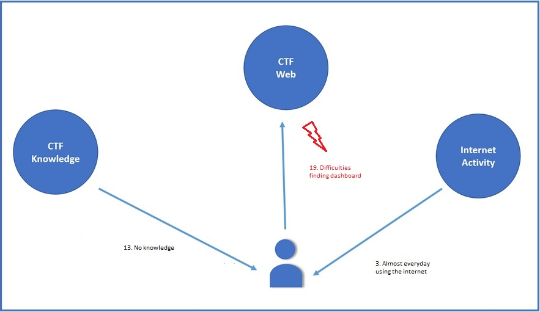

## Transcript 2

### Artifact Model

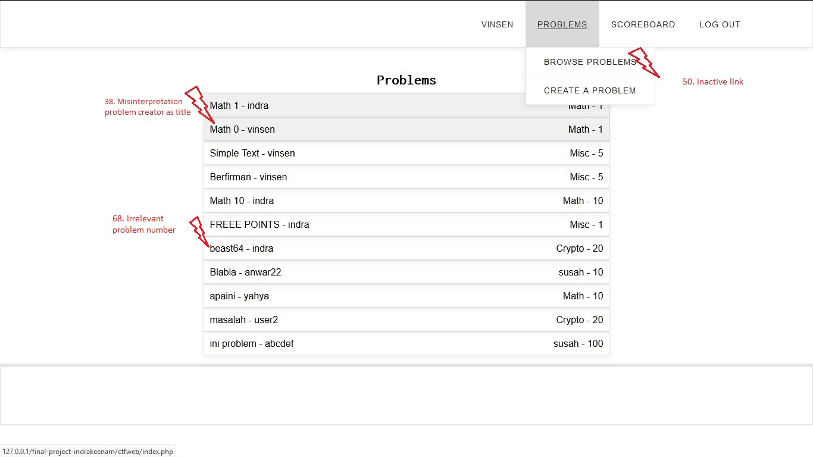

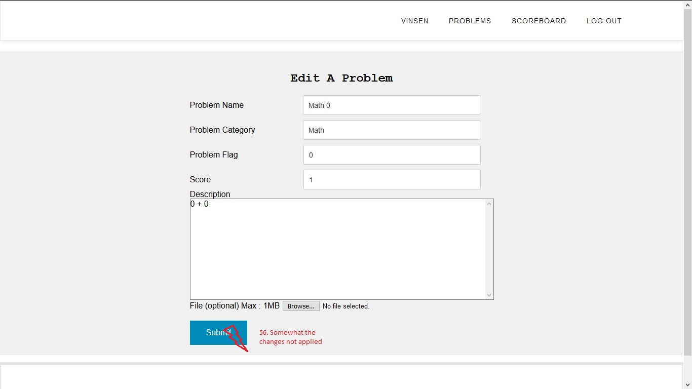

### Flow Model

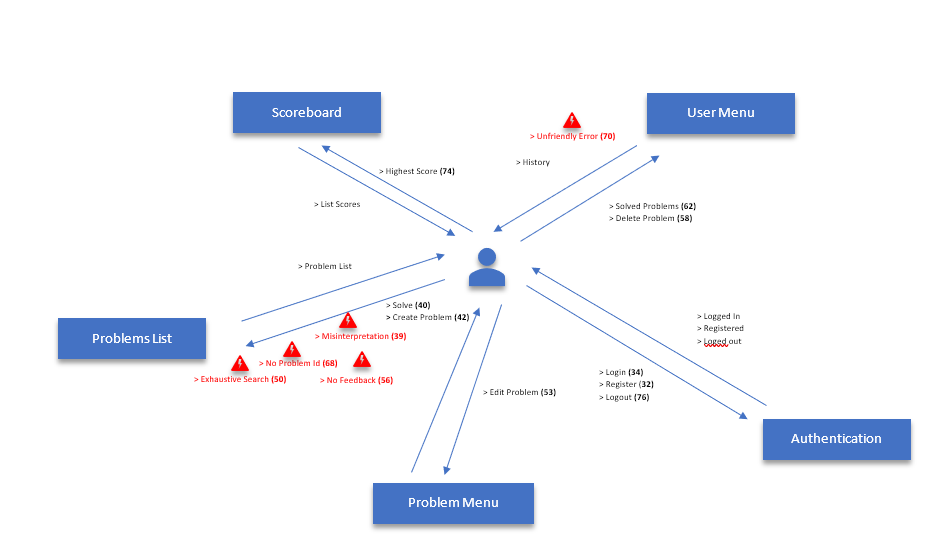

### Cultural Model

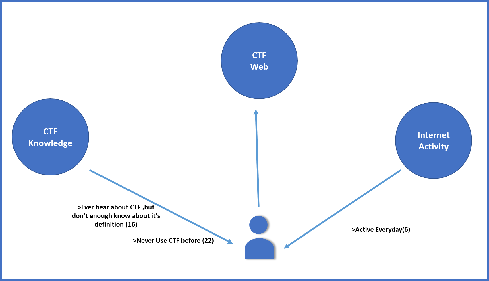

## Transcript 3

### Artifact Model

> **Problem [62]** : Participant does'nt know whether problem who he edited was saved or not

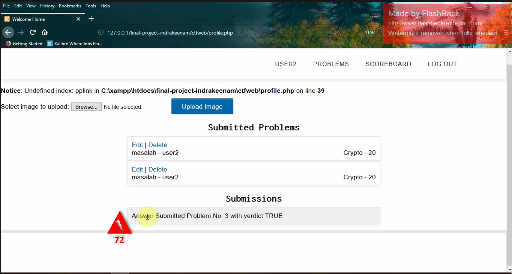
> **Problem [72]** : Participant difficult to find submission history location,and not too sure about submission history after he found it

> **Problem [76]** : Participant Unable to find the problem with the given number

> **Problem [78]** : Participant difficult to determine recent problem between his submitted problems.

### Flow Model

### Cultural Model
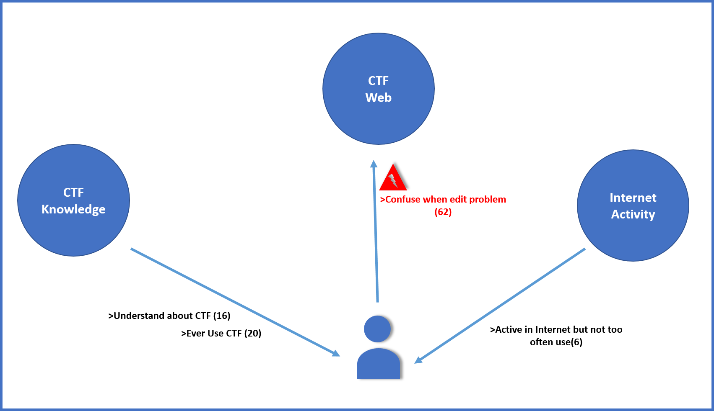

## Transcript 4

### Artifact Model

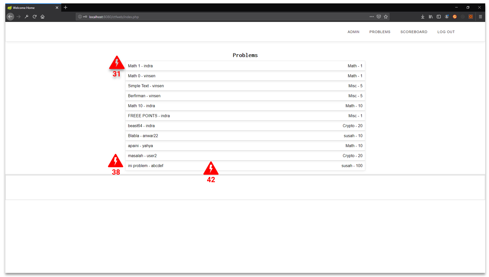
> **Problem [31]** : Participant can't tell the "Title" of the problems correctly
> **Problem [38]** : Participant tries to find their created problems in the problem menu.
> **Problem [42]** : Participant unable to edit their problem through their problem list.

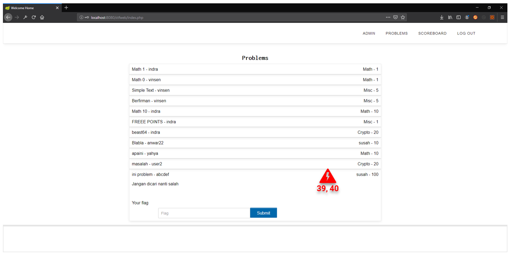
> **Problem [39 and 40]** : There is no feedback when opening or closing the expandable.

> **Problem [47]** : Participant perform exhaustive search to find a problem with a file in it.

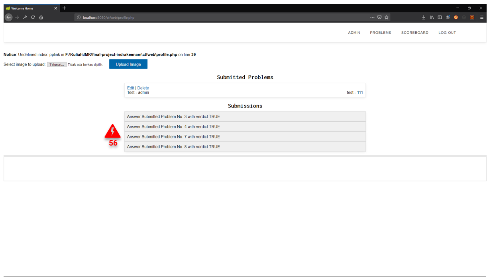
> **Problem [56]** : Participant unable to find the problem with the given number.

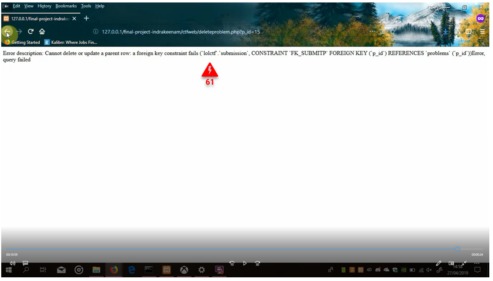
> **Problem [61]** : Participant didn't understand the error.

### Flow Model
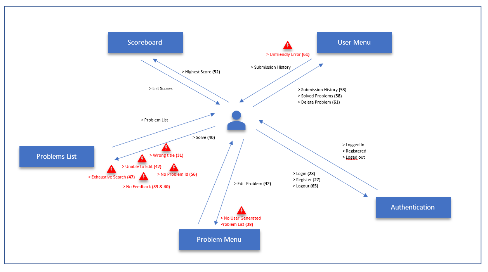

### Cultural Model

## Do's And Don't
### Do 
- Give feedback on user action
- Be consistent
- Group menu correctly
- Give hint (indicator) if some task had been finished by User
- Add capabilites of Sort descending problems which submitted by User by date or give date of submitted problem
- Have functional system

### Don't
- Make useless navigation
- Leave cryptics error
- Use number in someplace and then use it's title in other place (inconsistent)