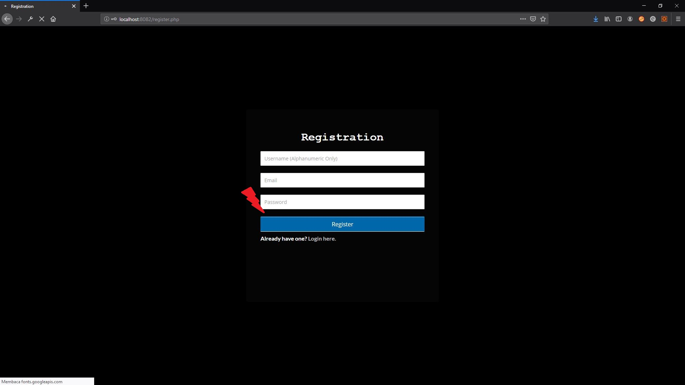
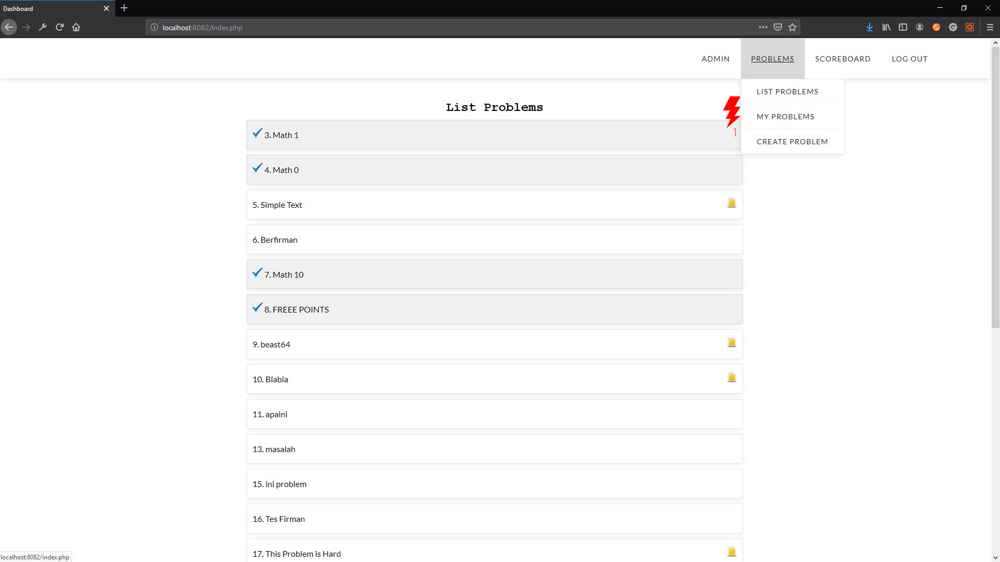
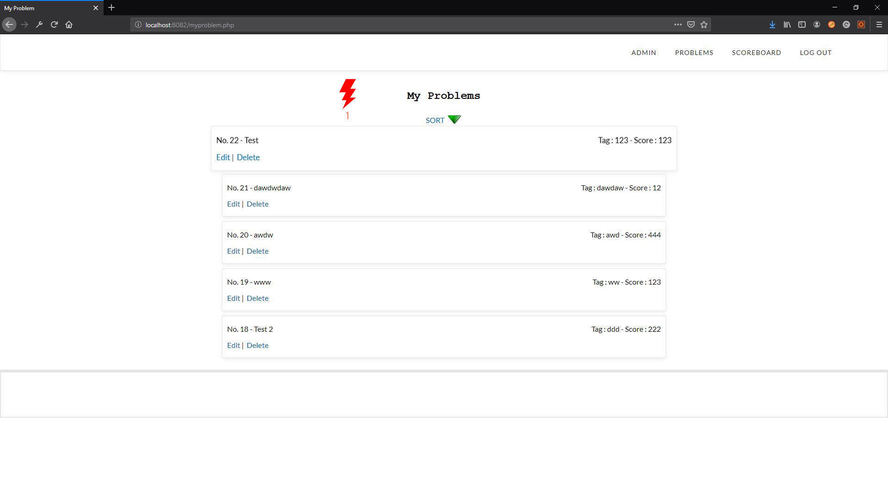

> [Home](../README.md)
# Usability Testing

## Question Script
This is the question that is asked before performing evaluation so we can understand what is the user's current background.

1. Did you categorize your self as an active internet user?
2. What kinds of website that you use daily?
3. Have you visited some website that you think has a bad design in it?
4. What did you think about it?
5. How difficult it is to achieve your desired goal using it?
6. What did you know about Capture The Flag?
7. Have you used a website that support Capture The Flag?
8. Have you use it before?
9. When the last time you use it?

## Evaluation Script
This script is used to evaluate the system's current interface. The user will be guided to follow this script.

1. Go to your dashboard
2. Show me the list of all available problems
3. Create a new problem and attach a file in it
4. Download a file from promblem X
5. Edit your last created problem
6. Solve problem X
7. Tell me the username with the highest score
8. Show me your submission history
9. Show me all of your submitted problems
10. Log out from the system

## Description

### Participant 1
- Male
- Informatics Student Batch 2017 at ITS
- Active Internet User
- Never do CTF before
- Know about CTF

### Participant 2
- Male
- Previous Participant
- Informatics Student Batch 2016 at ITS
- Active Internet User
- Never do CTF before
- Know about CTF (Has seen it)


### Participant 3
- Male
- Previous Participant
- Informatics Student Batch 2017 at ITS
- Active Internet User
- Never do CTF before
- Know about CTF

### Participant 4
- Male
- Informatics Student Batch 2016 at ITS
- Active Internet User
- Never do CTF before
- Know about CTF (in general)


## Transcript

### Participant 1
```
1. Me : Apakah anda mengkategorikan diri anda sebagai pengguna aktif internet?
2. Him : Ya
3. Me : Seberapa aktif biasanya?
4. Him : Mungkin dari sehari bisa lebih dari 8 jam menggunakan internet
5. Me : Biasanya mengunjungi website apa saja?
6. Him : Biasanya youtube, reddit, atau sosial media, sisanya saya gunakan untuk baca manga?
7. Me : Pernah enggak mengunjungi website yang memiliki design jelek?
8. Him : Pernah
9. Me : Menurut anda bagaimana?
10. Him : Ya website itu, misalkan suruh membuat akun, ya saya menemukan itu tombol registrasi itu sulit dicari dimana dan warna dari teks itu menyatu dengan background sehingga susah dilihat.
11. Me : Jadi kalau websitenya jelek itu kita susah mencapai tujuan kita gitu ya?
12. Him : Iya
13. Me : Pernah dengar Capture The Flag enggak?
14. Him : Pernah dengar
15. Me : Menurut anda itu ngapain ?
16. Him : Itu mencari flag tersembunyi gitu
17. Me : Pernah menggunakan website capture the flag belum sebelumnya?
18. Him : Belum
19. Me : Ini nanti akan ada instruksi nanti dilakukan aja ya
20. Him : Ya
21. Me : Kalau ada masalah apa gitu nanti kabarin aja
22. Him : Ya
23. Me : Pertama, bisa pergi ke dashboard anda?
24. Him : Register dulu ya ini?
25. Me : Bebas
26. Him : (*Clicked the "Register Here" text)
27. Him : Diisi bebas kan ini?
28. Me : Bebas, tapi diinget - inget aja, soalnya di pake login ntar ini
29. Him : (*Clicked Register)
30. Him : (*Clicked Login)
31. Him : (*Fill the form and clicked login and shown me the page)
32. Me : Bisa tunjukkan list problem yang ada?
33. Him : Yang di halaman ini ya?
34. Me : Ya
35. Him : (*Tell me all of the problem's title)
36. Me : Sekarang coba buat problem baru
37. Him : (*Hovered in problem and Clicked Create Problem)
38. Him : (*Filled the problem creation form and submit it)
39. Him : (*Shown me the result) Sudah
40. Me : Sekarang buat problem lagi tapi tambahkan file sekarang.
41. Him : (*Hovered in problem menu and Clicked Create Problem)
42. Him : (*Filled the problem creation form, attach the file and submit it)
43. Him : (*Shown me the result) Ok
44. Me : Silahkan cari file yang ada di list problem yang selain anda buat.
45. Him : Cari file
46. Him : (*Quickly found it) Buat file itu yang ada tanda disamping nya?
47. Me : Bebas, menurut anda yang mana?
48. Mim : (*Clicked the problem and downloaded the file)
49. Me : Terus, edit problem yang terakhir kali dibuat
50. Him : (*Him clicked "My Problem" and edited one of them and save it) Sudah
51. Me : Selesaikan salah satu problem
52. Me : Yang selain anda buat, bebas sih mau yang anda buat atau yang selain anda buat
53. Him : (*Clicked one of the problem and solved the problems quickly)
54. Me : Bisa enggak nunjukkin username dengan score tertinggi siapa?
55. Him : (*Clicked scoreboard) Username... [PEOPLE'S NAME].
56. Me : Bisa enggak nunjukkin tadi nyelesaiin apa aja?
57. Him : (*Go to List Problem) Bisa, baru diselesaikan math 1.
58. Me : Bisa enggak nunjukkin ngebuat problem apa saja?
59. Him : (*Go to My Problems) Bisa
60. Me : Silahkan menlogoutkkan sistemnya
61. Him : (*Clicked the Logout button)
```

### Participant 2
```
1. Me : Pertama itu, bisa tunjukkan dashboard nya?
2. Him : Ini adalah halaman login
3. Him : (*Proceed with creating an account and login)
4. Him : (*System throw username/password is incorrect) Bentar, bentar aku lupa password e
5. Him : (*Finally remember his password)
6. Me : Pertama, bisa sebutkan enggak, problem saat ini ada apa saja? beberapa saja?
7. Him : (*Tell all of the problem's title)
8. Me : Buatlah sebuah problem dan masukkan file di problem tadi ya
9. Him : (*Hover to Problem menu and clicked the create problem)
10. Him : (*Filled all the field and submit it) Sudah
11. Me : Lalu download sebuah file dari list problem yang ada tadi ya, jangan yang dibuat sendiri
12. Him : (*Go To Problem List and open one of problem with file and download it)
13. Me : Lalu, bisa enggak edit problem yang tadi di buat
14. Him : (*Go to my problem and edited one of the available problem)
15. Me : Sekarang bisa tunjukkan username dengan score tertinggi 
16. Him : (*Opened the scoreboard page)
17. Me : Siapa?
18. Him : [PEOPLE's NAME]
19. Me : Bisa tunjukkan enggak tadi nyelesai in apa aja?
20. Him : (*Clicked his username menu) Kan tadi belum nyelesaian problem apa apa
21. Me : Ohya belum ya, selesain problem satu dulu
22. Him : (*Go to Problem List and tries to solve one of the problem then go back to submission list)
23. Me : Bisa enggak tunjukkan nomor 23 yang mana?
24. Him : (*Shown his created problem (No 23)) Ini
25. Me : Sampe bener dong gitu?
26. Him : (*Edited his old problems and edited its answer) Salah jawaban mantab
27. Him : (*Clicked his problem and solved it)
28. Me : Bisa enggak nunjukkin problem - problem yang tadi anda buat apa aja?
28. Him : (*Opened My Problems page from problem)
29. Me : Oke lancar, nah silahkan di logout
30. Him : (*Clicked the logout button)
```
### Participant 3
```
1. Me :ini melanjutkan yang kemarin, jadi websitenya udah direvisi,langsung ke instruksinya aja ya
2. Him :(mencoba untuk login),(masuk ke dalam menu dashboard)
3. Me : pertama tunjukan list problem
4: ini udah
5. Me : selanjutnya buat problem baru
6. Him : (membuat problem baru)
7. Me : kalau ada masalah atau kurang gitu bilang aja
8. Him : masukan file juga
9. Me : iya
10. Him : udah (menyelsaikan pembuatan problem)
11. Me : selanjutnya download file dari list problem
12. Him : ini (mendownload salah satu problem),oke sudah
13. Me : selanjutnya edit problem yang ada
14. Him : mengedit problem,
15. Me : udah?
16. Him : udah
17. Me : selesaikan salah satu problem
18. Him : oke
19. Me : selsaikan selain problem anda
20. Him : (menyelsaikan problem)
21. Me : tunjukan user dengan score anda
22. Him : udah
23. Me : tunjukan daftar submisi pembuatan soal,e problem
24. Him : (masuk ke history submission) 
25. Me : daftar submisi pembuatan problem
26. Him : owh (masuk ke . Him problem)
27. Me : (oke),selanjutnya daftar submisi problem
28. Him : oke,(menunjukan riwayat submisi
```


### Participant 4
```
1. Me : Jadi kami dari kelompok IMK ingin melakukan uji coba website,jadi ini websitenya (menunjukan website),aplikasinya,jadi kamu nanti nguji website ini,menguji sistemnya bukan usernya,jadi kalau ada masalah atau kurangnya komen aja
2. Him : okeoke
3. Me : tetapi,sebelum pengujian kami ingin memberikan pertanyaan terlebih dahulu,yang pertama apakah anda mengkategorikan diri anda sebagai pengguna internet
4. Him : iya
5. Me : yang aktif?
6. Him : iya
7. Me : website apa yang sering kamu kunjungi?
8. Him : kalau website biasanya kumparan,kalau media sosial termasuk atau tidak?
9. Me : heem(iya)
10. Him : kalau media sosial itu,instagram
11. Me : seberapa sering,sehari berapa waktu yang kamu habiskan?
12. Him : kira-kira kalau sehari sejam lebih bisa sampai
13. Me : 2 jam
14. Him : 1 jam sampai 2 jam 
15. Me : pernah gak mengunjungi website yang desainya buruk?
16. Him : pernah
17. Me : bagaimana pendapatmu tentang itu?,tentang desain yang buruk itu.
18. Him : mungkin ini sih,ketemunya di PT.Pelni Indonesia itu,itu PT Pelayaran untuk Indonesia harusnyakan di bawah naungan pemerintah,pemerintah harusnya telah menganggarkan dana tapi kenapa desainnya seperti itu gitu lho,lebih ke arah situ sih,mungkin gampangnya sih,itu kan tiket pemesanan kan,mungkin untuk pemesanan tiket tersebut akan berkurang secara drastis,lebih memilih langsung ke loketnya seperti itu,dampaknya sih seperti itu
19. Me : menurut anda hubungan kesulitan mencapai tujuan tertentu dengan desain yang buruk itu apa
20. Him : mungkin dari pandangan pertama,karena banyak orang yang menilai,biasanya orang itu menilainya kan pada tampilan awalkan nah seperti itu,kalau tampilan awal gini,ntar orang mikir bakal,ahh tampilannya aja gini gimana dengan fitu-fiturnya gitu lho,mungkin pikiran orang pada kesitu
21. Me : tahu gak kamu tentang CTF atau Capture The Flag
22. Him : kalau sekedar tahu ya tahu
23. Me : menurutmu apa ?
24. Him : kalau menurutku itu sih sebuah website yang memfasilitasi pengguna terkhusunya apa ya,kayak hacker-hacker gitu hehe kata orang awam gitu kan mengenai hacker-hacker gitu ,bagaimana orang melatih hack kasarannya seperti itulah
25. Me : pernah gak mengunjungi website ctf sebelumnya?
26. Him : kalau situsnya belum
27. Me : pernah menggunakan ?
28. Him : belum
29. Me : kalau situs ctf nanti kamu tinggal,ada problem,disitu ada instruksi atau pertanyaan yang meminta memasukan key atua kunci jawaban,nah kunci jawaban itu bisa dicari dimanapun melalui instruksi melalui pertanyaan tersebut gitu,selanjutnya langsung ke instruksinya aja ya,pertama masuk ke dashboard
30. Him : ini (menunjuk halaman login)
31. Me : menurutmu yang dashboard yang itu
32. Him : kalau dashboard menurutku udah login,berarti register dulu ini ya
33. Me : ya
34. Him : apa udah dari situ ada passwordnya
35. Me : belum ada password
36. Him : (melakukan registrasi)
37. Me : kalau ada kurang atau nganu bilang aja
38. Him : (melakukan login)(terjadi kesalahan login)(melakukan resgiter kembali)
40. Me : selanjutnya,ini dashboardnya?
41. Him : ya
42. Me : tunjukan problem yang tersedia
43. Him : ini
44. Me : oke
45. Him : buat problem dan sisipkan file di dalamnya
46. Me : masukan filenya
47. Him : masukan (jelajah file)
48. Me : iya itu deskripnya,bebas sih
49. Him : ini nanya bolehkan sekaligus evaluasi
50. Me : iya
51. Him : problem category ini apa maksudnya?
52. Me : buat category soalnya,misalkan category hard atau apa gitu
53. Him : kalau gitu sih sebaiknya,dibuat dua gitu
54. Me : tapi cetegorynya gak harus deficultnya,tipe kesulitannya juga,itu mungkin problem apa bisa ditambahkan
55. Him : kalau gitu ,problem category bisa 2 category gak?
56. Me : ga bisa cuma satu
57. Him : kalau seharusnya,di satu sisi category easy,di sisi lain category encode gitu
58. Me : kalau gitu boleh
59. Him : easy koma,atau gimana?menurutku itu sih kayak bagaimana caranya,problem categorynya bisa beberapa,gak mungkin kan cetegory satu (!! permintaan usulan design tidak termasuk dalam usability test)
60. Me : oke
61. Him : kalau problem flag ini
62. Me : jawaban
63. Him : flagnya 10 (mengisi create problem),ini maksudnya gambar ini apa (menanyakan fungsi penyisipan file)
64. Me : itu nanti kalau ada yang mau ngerjain,bisa lihat kalau ada penyisipan file,misalkan ada
65. Him : kalau menghapus bagaimana (membatalkan penyisipan file)
66. Me : buat soal problem baru
67. Him : o gitu mungkin ,kan saya baru tahu kan,kirain,ini sebaiknya ada hapusnya (!! permintaan usulan design tidak termasuk dalam usability test) udah
67. Me : selanjutnya,download file dalam salah satu list problem,download file yang disisipkan
68. Him : (partisipan pada awalnya masih membuka problem secara acak dilanjutkan memilih problem berdasarkan icon) ini ni
(mendownload file )
69. Me : selanjutnya edit problem yang telah dibuat
70. Him : (melakukan pengeditan problem)
71. Me : itu kan ada(usulan untuk menambah fitur penghapusan di edit problem seperti pada create problem)
72. Him : itu pas di awal,tadi kan gak tahu itunya
73. Me : selanjutnya selesaikan salah satu problem
74. Him : waduh,yang mana nih
75. Me : kalau di edit kembali ke menu ini nih
76. Him : harusnya kembali keback aja,kayak komentator aja aku ini
77. Me : ya memang harus ya
78. Him : (memilih problem untuk diselsaikan) (menyelsaikan beberapa problem) salah ya,
79. Me : jangan soal sendiri
80. Him : bisa cuy
81. Me : ini rulenya ga boleh soal sendiri
82. Him : (mencoba mengerjakan beberapa soal)
83. Me : gak harus diselsaikan,ini yang mudah (menunjukan soal yang dapat dijawab)
84. Him : sepurane,(memilih soal) apa
85. Me : ada kesulitan gak waktu ngerjain,kesulitan dalam artian mengetahui
86. Him : kesulitan mungkin apa ya,gak ada masalah sih sebenarnya,cuman belum gara-gara belum pernah gunain ctf
87. Me : selanjutnya tunjukan username dengan score tertinggi
88. Him : (masuk menu scoreboard)
89.selanjutnya tunjukan sumbisi soal yang telah dibuat
90. Him : ohh yang dibuat (ini)
91. Me : selanjutnya tunjukan soal yang telah disubmit 
92. Him : oke
93. Me : selanjutnya log out
94. Him : (melakukan log out)
95. Me : terima kasih (partisipan)
96. Him : ga ada saran-sarannya
97. Me : haha ga ada,terima kasih loh ya

```

## Observation
Here is the list of observation that we found from this usability evaluation. We will only list any improvements or setbacks that we encounter from the last contextual inquiry.

### Observation - 1 - Login Page


 - **Reference**: None
 - **Feedback**: -
 - **Incidence**: -
 - **Reason**: -
 - **Resolution**: -

### Observation - 2 - Login Failed Page


 - **Reference**: TBD
 - **Feedback**: None
 - **Incidence**: -
 - **Reason**: -
 - **Resolution**: -

### Observation - 3 - Register Page


 - **Reference**: TBD
 - **Feedback**: None
 - **Incidence**: -
 - **Reason**: -
 - **Resolution**: -

### Observation - 4 - Register Success Page


 - **Reference**: TBD
 - **Feedback**: None
 - **Incidence**: -
 - **Reason**: -
 - **Resolution**: -

### Observation - 5 - Register Failed Page


 - **Reference**: TBD
 - **Feedback**: None
 - **Incidence**: -
 - **Reason**: -
 - **Resolution**: -

### Observation - 6 - Problem List Page


---
 - **Picture Reference**: 1
 - **Transcript Reference**: [Participant 1 Line 35], [Participant 2 Line 7]
 - **Feedback**: Positive
 - **Incidence**: Participant are able to tell us exactly the problem's title
 - **Reason**: Problem Creator's name has been shifted to problem's body
 - **Resolution**: -
---
 - **Picture Reference**: 2
 - **Transcript Reference**: [Participant 1 Line 57]
 - **Feedback**: Positive
 - **Incidence**: Participant understand which problem that they have solved
 - **Reason**: There is an Icon that indicate solved problem
 - **Resolution**: -
---
 - **Picture Reference**: 2
 - **Transcript Reference**: [Participant 2 Line 24]
 - **Feedback**: Positive
 - **Incidence**: Participant understand which problem has certain id
 - **Reason**: There is a numbering besides the problem's title
 - **Resolution**: -
---
 - **Picture Reference**: 3
 - **Transcript Reference**: [Participant 1 Line 53]
 - **Feedback**: Positive
 - **Incidence**: Participant knows that the problem's title is clickable even though he never use this prototype before
 - **Reason**: The cursor changes into pointer (hand) symbol
 - **Resolution**: -
---
 - **Picture Reference**: 4
 - **Transcript Reference**: [Participant 1 Line 46]
 - **Feedback**: Positive
 - **Incidence**: The user quickly knows that there is a file in this problem
 - **Reason**: There is an Icon that indicate that this problem contain downloadable file
 - **Resolution**: -
---
### Observation - 7 - Problem Menu Page


---
 - **Picture Reference**: 1
 - **Transcript Reference**: [Participant 1 Line 37, 41, 50, 59], [Participant 2 Line 9, 12, 14, 28]
 - **Feedback**: Positive
 - **Incidence**: Participant can quickly find any problem related feature in the problem menu
 - **Reason**: We grouped together any problem related feature in one menu
 - **Resolution**: -
---
 ### Observation - 8 - Profile Page


 - **Reference**: TBD
 - **Feedback**: None
 - **Incidence**: -
 - **Reason**: -
 - **Resolution**: -

### Observation - 9 - My Problem Page


---
 - **Picture Reference**: 1
 - **Transcript Reference**: [Participant 1 Line 59], [Participant 2 Line 28]
 - **Feedback**: Positive
 - **Incidence**: Participant can easily found their created problems
 - **Reason**: There is a page that is dedicated to show participant's problems
 - **Resolution**: -
---

### Observation - 9 - Create Problem Page


 - **Reference**: TBD
 - **Feedback**: None
 - **Incidence**: -
 - **Reason**: -
 - **Resolution**: -

### Observation - 10 - Edit Problem Page


 - **Reference**: TBD
 - **Feedback**: None
 - **Incidence**: -
 - **Reason**: -
 - **Resolution**: -

### Observation - 11 - Scoreboard Page


 - **Reference**: TBD
 - **Feedback**: None
 - **Incidence**: -
 - **Reason**: -
 - **Resolution**: -

## Prototype
### Sketch
Here is the link to High Fidelity https://projects.invisionapp.com/freehand/document/9nFqUAPrI

### Design Rationale
Based on current usability evaluation we found out that we need to provide a way for user to check what they write on an obscured field, for example password field. We decided to add confirm password field to it.

### High Fidelity Prototype
For highfidelity prototype please download our final source code [HERE](source/final)
